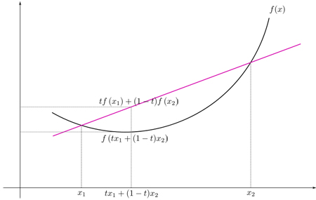
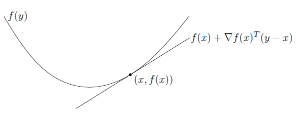

---
title: 'Topic 4: Introduction to Optimization'
author: "Irina Gaynanova"
output: beamer_presentation
urlcolor: blue
---

```{r setup, include=FALSE}
knitr::opts_chunk$set(echo = FALSE)
```

```{r wrap-hook}
library(knitr)
hook_output = knit_hooks$get('output')
knit_hooks$set(output = function(x, options) {
  # this hook is used only when the linewidth option is not NULL
  if (!is.null(n <- options$linewidth)) {
    x = knitr:::split_lines(x)
    # any lines wider than n should be wrapped
    if (any(nchar(x) > n)) x = strwrap(x, width = n)
    x = paste(x, collapse = '\n')
  }
  hook_output(x, options)
})
```

## Optimization

Good references (*see syllabus*):

  - "Convex Optimization" by Boyd and Vandenberghe
  - Chapter 5 in "Statistical Learning with Sparsity" by Hastie et al.


## Optimization terminology

We will consider the following general optimization problem:  
\begin{equation*}
\begin{split}
	\text{minimize}_x \quad&f({\bf{x}}) \\
	\text{subject to}\quad & g_j({\bf{x}})\leq0,\quad j = 1, 2, ..., m; \\& h_k({\bf{x}})=0,\quad  k = 1, 2,...,l.
\end{split} 
\end{equation*}

  - $\bf{x}\in R^p$: **optimization variable** (in this class, could be a scalar, vector or a matrix)
  - $f(\bf{x}): R^p \rightarrow R$: **objective function**
  - $g_j:R^{p}\rightarrow R$ and $g_j({\bf{x}})\leq0$: **inequality constraints**
  - $h_k:R^{p}\rightarrow R$ and $h_k({\bf{x}})=0$: **equality constraints**
  - If no constraints: **unconstrained problem**
  
## Optimization terminology

We will consider the following general optimization problem:  
\begin{equation*}
\begin{split}
	\text{minimize}_x \quad&f({\bf{x}}) \\
	\text{subject to}\quad & g_j({\bf{x}})\leq0,\quad j = 1, 2, ..., m; \\& h_k({\bf{x}})=0,\quad  k = 1, 2,...,l.
\end{split} 
\end{equation*}

  - A point $\bf{x}\in R^p$ is **feasible** if it satisfies all the constraints. Otherwise, it's **infeasible**.
  - The **optimal value** $f^*$ is the minimal value of $f$ over the set of feasible points
  
## Example 1: Least squares linear regression
Given training data $X\in R^{n \times p}$ and $Y \in R^n$ with $rank(X) = p$

\begin{equation*}
\text{minimize}_{\beta}\|Y-X\beta\|_2^2
\end{equation*}

- **unconstrained** optimization problem
- any $\beta \in R^p$ is **feasible**
- the optimal value $f^* = \|Y - X(X^{\top}X)^{-1}X^{\top}Y\|_2^2$

## Optimization terminology

We will consider the following general optimization problem:  
\begin{equation*}
\begin{split}
	\text{minimize}_x \quad&f({\bf{x}}) \\
	\text{subject to}\quad & g_j({\bf{x}})\leq0,\quad j = 1, 2, ..., m; \\& h_k({\bf{x}})=0,\quad  k = 1, 2,...,l.
\end{split} 
\end{equation*}

  - The **optimal value** $f^*$ is the minimal value of $f$ over the set of feasible points
  - $x^*$ is **globally optimal** if $x$ is *feasible* and $f(x^*) = f^*$
  - $x^*$ is **locally optimal** if $x$ is *feasible* and for each feasible $x$ in the neighborhood $\|x - x^*\|_2\leq R$ for some $R>0$, $f(x^*)\leq f(x)$.
  
## Example 1: Least squares linear regression
Given training data $X\in R^{n \times p}$ and $Y \in R^n$ with $rank(X) = p$

\begin{equation*}
\text{minimize}_{\beta}\|Y-X\beta\|_2^2
\end{equation*}

- **unconstrained** optimization problem
- any $\beta \in R^p$ is **feasible**
- the optimal value $f^* = \|Y - X(X^{\top}X)^{-1}X^{\top}Y\|_2^2$
- the globally optimal $\beta^* =  (X^{\top}X)^{-1}X^{\top}Y$ (also locally optimal, the only locally optimal point)


## Example 2: Principal Component Analysis
Given training data $X\in R^{n \times p}$ that is column-centered, the first principal loading $v\in R^p$ is found as the solution to

\begin{equation*}
\begin{split}
\text{minimize}_{v}&\{-v^{\top}X^{\top}Xv\}\\
\text{subject to}\quad & v^{\top}v = 1.
\end{split}
\end{equation*}

- optimization problem with one **equality constraint**
- $v = \bf{0}$ is **infeasible**
- the optimal value $f^*$ is minus the largest eigenvalue of $X^{\top}X$
- the globally optimal $v^*$ is the eigenvector of $X^{\top}X$ corresponding to the largest eigenvalue

## Unconstrained optimization problem

Consider minimizing differentiable function $f$
$$
\text{minimize}_x f(x)
$$

A point $x'$ is called **stationary** if 
$$
\nabla f(x') = 0.
$$
All local optimal points are **stationary** points.

Globally optimal $x^*$ satisfies $\nabla f(x^*) = 0$, but locally optimal and stationary points also satisfy it.

For **convex** f, any solution to $\nabla f(x^*) = 0$ is globally optimal.


## Convex optimization problems

 - Very common in statistics, *easier* to solve, genereally have nice algorithms
 
 \begin{definition} A function $f: R^p \to R$ is \textbf{convex} if for all $x_1, x_2 \in R^p$ and all $\alpha \in [0,1]$,
 $$
 f(\alpha x_1 + (1-\alpha)x_2)\leq \alpha f(x_1) + (1-\alpha) f(x_2)
 $$
 and is \textbf{strictly convex} if for all $x_1, x_2 \in R^p$, $x_1\neq x_2$, and all $\alpha \in (0,1)$
 $$
 f(\alpha x_1 + (1-\alpha)x_2)< \alpha f(x_1) + (1-\alpha) f(x_2)
 $$
 \end{definition}

 - **Interpretation**: The chord between two points is always above the function
 
 
## Convex optimization problems



## Convex optimization problems

 \begin{theorem}
\underline{First order conditions (for differentiable f)}
\begin{itemize}
\item $f$ is convex $\iff$ $f(y)\geq f(x)+\nabla f(x)^\top(y-x)$, $\forall x,y\in\mathbb{R}^p$. 
\item $f$ is strictly convex $\iff$ $f(y)> f(x)+\nabla f(x)^\top(y-x)$, $\forall x,y\in\mathbb{R}^p$ and $x\neq y$.
\end{itemize}
 \end{theorem}

  - **Interpretation**: function lies above its tangent
  
## Convex optimization problems



## Convex optimization problems

\begin{theorem}
\underline{Second order conditions (for twice differentiable f)}
\begin{itemize}
\item $f$ is convex $\iff$ Hessian $\nabla^2 f(x)\succeq 0$, $\forall x\in\mathbb{R}^p$. (pos.semi-def)
\item $f$ is strictly convex $\iff$ Hessian $\nabla^2 f(x)\succ0$, $\forall x\in\mathbb{R}^p$  (strictly pos.semi-def)
\end{itemize}
\end{theorem}

   - Often easiest to check in practice, i.e. 
   $$f(x) = x^2, \quad \nabla^2 f(x) = 2 >0.$$
   $$
   f(x) = \|x\|_2^2, \quad \nabla f(x) = 2x, \quad \nabla^2 f(x) = 2I \succ 0.
   $$
   
## Examples of convex functions

  - $-\log(x)$
  - $e^x$
  - $|x|^p$, $p\geq 1$
  - Any norm on $\mathbb{R}^p$
  - $-\log(\text{det}(\Sigma))$, where $\Sigma$ is positive definite
  
## Operations that preserve convexity

\begin{itemize}
\item Non-negative weighted sum: $\sum_{i=1}^k w_if_i$, where $w_i\geq0$ and  $f_i,i=1,...,k$ are convex functions.
\item If $f$ is convex, and $g(x)=f(Ax+b)$, then $g$ is convex.
\item If $f_1,...,f_k$ are convex functions, then $\max(f_1,...,f_k)$ is also convex.
\item ... not exhaustive list
\end{itemize} 

## What about convex function applied to another convex function?

If $h(x)$ is convex, and $f(x)$ is convex, then $g(x) = f(h(x))$ is **not necessarily** convex

 * $g(x) = -x^2$
 * $g(x) = (\|x\|_2^2 - 1)^2$
 
**Special case:** if $h(x) = Ax + b$ (linear), then $g(x)$ is convex

  * g(x) = (-x)^2
  * g(x) = (x - 1)^2

## Example

Least squares loss function is convex

$$f(\beta) = \|Y-X\beta\|_2^2$$

Why?

- The hessian is $\nabla^2f(\beta) = 2X^{\top}X\succeq 0$ (semi positive definite)
- $f(\beta)=g(Y-X\beta)$, where $g(x) = \|x\|_2^2$ is convex as a norm squared


## Recall unconstrained optimization problem

Consider minimizing differentiable function $f$
$$
\text{minimize}_x f(x)
$$

A point $x'$ is called **stationary** if 
$$
\nabla f(x') = 0.
$$
All local optimal points are **stationary** points.


Globally optimal $x^*$ satisfies $\nabla f(x^*) = 0$, but locally optimal and stationary points also satisfy it.


## Unconstrained convex optimization problem
Consider
$$
\text{minimize}_x f(x)
$$
This is a **convex** optimization problem if $f(x)$ is **convex**

**Important property 1**: any locally optimal point of a convex problem is globally optimal

**Important property 2**: If $f$ is differentiable, $x^*$ is optimal if and only if

$$
\nabla f(x)|_{x=x^*} = 0.
$$

## Example: Least Squares

Least squares solves
$$
\text{minimize}_{\beta}\|Y-X\beta\|_2^2
$$
This is a convex unconstrained optimization problem, so the solution must satisfy
\begin{align*}
\nabla\|Y-X\beta\|_2^2 &= \nabla(\|Y\|_2^2 - 2Y^{\top}X\beta + \beta^{\top}X^{\top}X\beta)\\
&= -2X^{\top}Y + 2X^{\top}X\beta = 0
\end{align*}
This is equivalent to
$$
X^{\top}X\beta = X^{\top}Y
$$

If $X^{\top}X$ is **invertible**, global solution is $\beta^* = (X^{\top}X)^{-1}X^{\top}Y$.


## Example: Least Squares

Least squares solves
$$
\text{minimize}_{\beta}\|Y-X\beta\|_2^2
$$
This is a convex unconstrained optimization problem, so the solution must satisfy
\begin{align*}
\nabla\|Y-X\beta\|_2^2 &= \nabla(\|Y\|_2^2 - 2Y^{\top}X\beta + \beta^{\top}X^{\top}X\beta)\\
&= -2X^{\top}Y + 2X^{\top}X\beta = 0
\end{align*}
This is equivalent to
$$
X^{\top}X\beta = X^{\top}Y
$$

If $X^{\top}X$ is **not invertible**, **multiple** global solutions (give same $f^*$)


## Example: Maximum Likelihood Estimation

Observations $x_i$, $i=1,\dots, n$, independent samples from distribution with density $f(x;\theta)$ with some parameter $\theta\in \mathbb{R}^d$

**Maximum Likelihood Estimator (MLE)**
$$
\widehat \theta = \arg\max_{\theta} \prod_{i=1}^nf(x_i; \theta)
$$
Typically, we maximize **log-likelihood** which is equivalent to
$$
\widehat \theta = \arg\min_{\theta}\left\{-\sum_{i=1}^n\log f(x_i; \theta)\right\}
$$
This is **convex optimization** if $-log(f)$ is convex or $f$ is -log-convex.


## MLE example

Normal likelihood with known variance $\sigma^2$
$$
f(x; \theta) = \frac1{\sqrt{2\pi\sigma^2}}\exp\left(-\frac{(x-\theta)^2}{2\sigma^2}\right)
$$
Here $\theta$ is the unknown mean.

Log-likelihood
$$
\log f(x; \theta) = -\frac12\log(2\pi\sigma^2) - \frac1{2\sigma^2}(x-\theta)^2 = C -\frac1{2\sigma^2}(x-\theta)^2
$$
**MLE** optimization problem
$$
\widehat \theta = \arg\min_{\theta}\left\{-\sum_{i=1}^n-\frac1{2\sigma^2}(x_i-\theta)^2\right\} = \arg\min_{\theta}\sum_{i=1}^n(x_i-\theta)^2
$$

## MLE example

**MLE** optimization problem
$$
\widehat \theta = \arg\min_{\theta}\left\{-\sum_{i=1}^n-\frac1{2\sigma^2}(x_i-\theta)^2\right\} = \arg\min_{\theta}\sum_{i=1}^n(x_i-\theta)^2
$$

This is **convex optimization problem**. Why?

The optimality conditions
$$
-2\sum_{i=1}^nx_i + 2n\theta = 0.
$$
The optimal $\widehat \theta = n^{-1}\sum_{i=1}^nx_i = \bar x$ - sample mean.

## Summary

Unconstrained optimization problem with differentiable $f$:
$$
\text{minimize}_x f(x).
$$
To find global optimum, need to solve optimality conditions
$$
\nabla f(x) = 0.
$$
For **convex** $f$ - any solution to above is **globaly optimal**.

Least squares problem has closed form solution.

What if exact solution is not tractable? Need **numerical methods**

## Example 1
$$
f(x) = (x-50)^2 + e^x/50
$$

```{r, echo = F}
 f <- function(x){
    (x - 50)^2 + exp(x)/50
  }
plot(seq(-10,12, length = 100), f(seq(-10,12, length = 100)), type = "l", xlab = "x", ylab = "f(x)") #plot function on an interval
```

## General purpose solver

For one-dimensional optimization, one can utilize R function _optimize_

```{r, echo = TRUE}
  f <- function(x){
    (x - 50)^2 + exp(x)/50
  }
optimize(f, interval = c(-1000, 1000))
```

## General purpose solver

One can also start with optimality conditions and treat it as a root-finding problem
$$
f(x) = (x-50)^2 + e^x/50, \quad f'(x) = 2x - 100 + e^x/50 = 0
$$

R function _uniroot_

```{r, echo = TRUE}
  fprime <- function(x){
    2 * x - 100 + exp(x)/50
  }
uniroot(fprime, interval = c(-1000, 1000))
```

## General purpose solver

One can also translate root finding problem into optimization problem (the root must exist).

Suppose you want to find the root of 
$$
g(x) = 0.
$$

* Let $f(x) = g(x)^2$, then one can consider
$$
\text{minimize}_x f(x).
$$
You can then use *optimize* function on $f(x)$.

* You can also take an integral of $g(x)$ to find $f(x)$ such that $\nabla f(x) = g(x)$, and then use *optimize* on $f(x)$.


