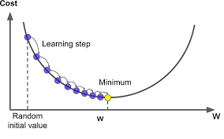

```{r setup, include=FALSE}
knitr::opts_chunk$set(echo = FALSE)
```

```{r wrap-hook}
library(knitr)
hook_output = knit_hooks$get('output')
knit_hooks$set(output = function(x, options) {
  # this hook is used only when the linewidth option is not NULL
  if (!is.null(n <- options$linewidth)) {
    x = knitr:::split_lines(x)
    # any lines wider than n should be wrapped
    if (any(nchar(x) > n)) x = strwrap(x, width = n)
    x = paste(x, collapse = '\n')
  }
  hook_output(x, options)
})
```

## Before we start


* Please accept the **GradientMethodsExamples** link that gives you access to Github with some starter code:
[Click this link for starter code](https://classroom.github.com/a/njiURYWN)
* **Star** the repository for easy access later
* Clone the repository to your local computer
* Open the associated R project in Rstudio

There will also be some algebra, so you may want to have pen/pencil and notebook ready.

## Gradient methods: steepest (gradient) descent

- Choose a step size $\alpha > 0$ (more on this later, sometimes called **learning rate** or **learning step**)

- Start with an initial guess $x_0$

- At each iteration $t$, compute $x_{t+1} = x_t - \alpha \nabla f(x_t)$

- Continue until some **convergence criterion** is met i.e. $f(x_{t+1}) \approx f(x_t)$

<!-- **Implement the Steepest Descent** with given $\alpha$ and number of iterations in SteepestDescent.R -->

## Steepest descent - intution

Want to find solution $x^*$ such that
$$
\nabla f(x^*) = 0.
$$
For $\alpha >0$, at solution
$$
\alpha \nabla f(x^*) = x^* - x^*.
$$
**Steepest descent** update rewritten
$$
\alpha \nabla f(x_t) = x_{t} - x_{t+1}.
$$

## Steepest descent - intution




## Steepest descent

- Choose a step size $\alpha > 0$ (more on this later, sometimes called **learning rate** or **learning step**)

- Start with an initial guess $x_0$

- At each iteration $t$, compute $x_{t+1} = x_t - \alpha \nabla f(x_t)$

- Continue until some **convergence criterion** is met i.e. $f(x_{t+1}) \approx f(x_t)$

This attempts to find solution to
$$
\nabla f(x) = 0.
$$
  
## Steepest descent - example
$$
f(x) = (x-50)^2 + e^x/50
$$

```{r, echo = F}
  f <- function(x){
    (x - 50)^2 + exp(x)/50
  }
```

```{r, echo = F}
plot(seq(-10,12, length = 100), f(seq(-10,12, length = 100)), type = "l", xlab = "x", ylab = "f(x)") #plot function on an interval
```


## Steepest descent - implementation

  - For simplicity, focus on one-dimensional case first
  - Open **SteepestDescent.R** and follow the instructions to implement steepest descent
  - If you go ahead, **Example1.R** has the code that lets you play with function $f(x)$ and optimization with different $\alpha$ values

## Steepest descent - example
$$
f(x) = (x-50)^2 + e^x/50, \quad f'(x) = 2x - 100 + e^x/50 = 0
$$

The choice of step size is very important!!

- **Too small $\alpha$** - very small difference between updates, larger number of iterations
- **Too large $\alpha$** - oscillations, may not converge

Use **Example1.R** to check different values of $\alpha$ on the given function. How may you monitor the convergence?

## Steepest descent in practice

- Very simple
- Only requires the first derivative
- Used in many machine learning methods, i.e. in neural nets (with additional stochastic updates)

## Newton's method
Recall we want to find solution $x^*$ to
$$
\nabla f(x) = 0.
$$
By Taylor expansion
$$
\nabla f(x^*) = \nabla f(x) + \nabla^2 f(x)(x^* - x) + \mbox{higher order terms.}
$$
Since $\nabla f(x^*)=0$, must have $\nabla f(x) + \nabla^2 f(x)(x^* - x) \approx 0$, leading to
$$
x^* \approx x - \{\nabla^2 f(x) \}^{-1}\nabla f(x).
$$
One dimensional case update
$$
x_{t+1} = x_t - \frac{f'(x_t)}{f''(x_t)}
$$


## Newton's method vs Steepest descent (one - dimensional)

- Steepest descent
$$
x_{t+1} = x_t - \alpha f'(x_t)
$$
- Newton's method: Steepest descent with $\alpha = 1/f''(x_t)$ (**changes with t**)
$$
x_{t+1} = x_t - \frac{f'(x_t)}{f''(x_t)}
$$

## Newton's method - illustration

- The closer is $x_0$ to the optimal value $x^*$, the faster is the convergence


](rootfindingnewton.jpg)


## Newton's method - example
$$
f(x) = (x-50)^2 + e^x/50, \quad f'(x) = 2x - 100 + e^x/50 = 0
$$
$$
f''(x) =  2 + e^x/50
$$

**Implement Newton's method** in **NewtonsMethod.R**, and then test it on function f following **Example1.R**


## Recall
Convex optimization problem:
$$
\text{minimize}_x f(x), \quad f - \text{convex function.}
$$
To find global optimum, need to solve optimality conditions
$$
\nabla f(x) = 0.
$$

Discussed R built-in solvers, steepest descent algorithm and Newton's method.

In general, these algorithm aim to find any solution to the above, so may be applied with nonconvex problems as well.

\textbf{Next:} Application in the context of binary logistic regression.

## Binary logistic regression

$n$ samples $(x_i, y_i)$, $x_i\in \mathbb{R}^p$, $y_i\in \{0,1\}$ (two classes, similar to discriminant analysis, but different coding)

$$
P(y_i = 1|x_i):=p(x_i),\quad P(y_i=0|x_i) = 1-p(x_i). 
$$
In logistic regression, we assume
$$
\log\frac{p(x_i)}{1-p(x_i)} = \beta_0 + \beta_1 x_{i,1} + \dots + \beta_p x_{i,p} = \beta_0 + \beta^{\top}x_i = \beta^{\top}x_i,
$$
where the last equality holds if we add a column of 1s to matrix $X\in \mathbb{R}^{n \times p}$

## Binary logistic regression

$$
P(y_i = 1|x_i):=p(x_i),\quad P(y_i=0|x_i) = 1-p(x_i). 
$$

The class membership $y_i$ is dependent on covariates $x_i\in \mathbb{R}^p$ via some unknown function $p(x_i):\mathbb{R}^p \to [0,1]$.

$$
\log\frac{p(x_i)}{1-p(x_i)} = \beta^{\top}x_i.
$$
In binary logistic regression, we make an assumption that this function has a specific form:
$$
p(x_i; \beta) = \frac{e^{x_i^{\top}\beta}}{1+ e^{x_i^{\top}\beta}}.
$$
$p(x_i; \beta)$ emphasizes that **$\beta$ is the only unknown component of this function**

## Binary logistic regression

In binary logistic regression, we make an assumption that
$$
P(y_i = 1|x_i) = p(x_i; \beta) = \frac{e^{x_i^{\top}\beta}}{1+ e^{x_i^{\top}\beta}}.
$$
If we know $\beta$, we can calculate these probabilities for any new observation $x$ and determine class assignment based on the largest probability

How do we find $\beta$? Use maximum likelihood

## Binary logistic regression

$$
\log\frac{p(x_i)}{1-p(x_i)}  = \beta^{\top}x_i \quad \mbox{ leads to }\quad  p(x_i; \beta) = \frac{e^{x_i^{\top}\beta}}{1+ e^{x_i^{\top}\beta}}
$$
Similarly
$$
1 - p(x_i; \beta) = \frac{1}{1+ e^{x_i^{\top}\beta}}.
$$
For the $i$th sample with $(x_i, y_i)$, the log-likelihood becomes
$$
l_i(\beta|x_i) = (1 - y_i)\log\{1 - p(x_i; \beta)\} + y_i \log p(x_i; \beta).
$$
**Why?**


## Joint likelihood for logistic regression
$$
l_i(\beta|x_i, y_i) = (1 - y_i)\log\{1 - p(x_i; \beta)\} + y_i \log p(x_i; \beta).
$$
Expression for probabilities
$$
p(x_i; \beta) = \frac{e^{x_i^{\top}\beta}}{1+ e^{x_i^{\top}\beta}}, \quad 1 - p(x_i; \beta) = \frac{1}{1+ e^{x_i^{\top}\beta}}.
$$

For $n$ independent samples,
\begin{align}
l(\beta| X, Y) &= \sum_{i=1}^nl_i(\beta|x_i, y_i) = \mbox{some algebra} \\
&= \sum_{i=1}^n\{y_ix_i^{\top}\beta - \log(1 + e^{x_i^{\top}\beta})\}
\end{align}

## Some algebra
Recall $\log\frac{p(x_i)}{1-p(x_i)} = \beta^{\top}x_i.$
\begin{align}
l&(\beta| X, Y) \\
&= \sum_{i=1}^nl_i(\beta|x_i, y_i) \\
&= \sum_{i=1}^n[(1 - y_i)\log\{1 - p(x_i; \beta)\} + y_i \log p(x_i; \beta)]\\
&= \sum_{i=1}^n[y_i\log(p(x_i; \beta)/(1-p(x_i; \beta)) + \log\{1 - p(x_i; \beta)\}]\\
&= \sum_{i=1}^n[y_ix_i^{\top}\beta - \log(1 + e^{x_i^{\top}\beta})]
\end{align}


## Maximum likelihood estimation
In binary logistic regression, we make an assumption that
$$
P(y_i = 1|x_i) = p(x_i; \beta) = \frac{e^{x_i^{\top}\beta}}{1+ e^{x_i^{\top}\beta}}.
$$


We want to estimate the unknown $\beta$ by solving
$$
\hat \beta = \arg\min_{\beta}\underbrace{\sum_{i=1}^n\{-y_ix_i^{\top}\beta + \log(1 + e^{x_i^{\top}\beta})\}}_{f(\beta)}.
$$
Go to **FunctionsBinaryLogistic.R** and fill in the function **logistic_objective** to calculate the objective value $f(\beta)$ for given matrix $X$, vector $y$ and vector $\beta$.


## Maximum likelihood estimation

We want to find
$$
\hat \beta = \arg\min_{\beta}\sum_{i=1}^n\{-y_ix_i^{\top}\beta + \log(1 + e^{x_i^{\top}\beta})\}.
$$
Is this a convex optimization problem?

**Yes**, because

  - $-y_ix_i^{\top}\beta$ is linear in $\beta$, hence convex (and concave)
  
  - $f(x) = \log(1+e^x)$ is convex because
  $$
  f'(x) = \frac{e^x}{1+e^x},\quad f''(x) = \frac{e^x}{1+e^x} - \frac{e^{2x}}{(1+e^x)^2} = \frac{e^x}{(1+e^x)^2} >0.
  $$
 
  - $\log(1+e^{x_i^{\top}\beta}) = f(x_i^{\top}\beta)$ - convex function of linear combination

## Maximum likelihood estimation - gradient calculation

We want to find
$$
\hat \beta = \arg\min_{\beta}\underbrace{\sum_{i=1}^n\{-y_ix_i^{\top}\beta + \log(1 + e^{x_i^{\top}\beta})\}}_{f(\beta)}.
$$
This is a convex optimization problem. Need gradient (for both steepest descent and Newton), and Hessian matrix (for Newton). One can check (**exercise**) that

$$
\frac{\partial f(\beta)}{\partial \beta_j} = \sum_{i=1}^nx_{ij}\{-y_i + p(x_i; \beta)\} = -X_j^{\top}\{y - P(X;\beta)\},
$$
where $X_j$ is the $j$th column of matrix $X$, and $P(X; \beta)\in \mathbb{R}^n$ is a vector with elements $p(x_i; \beta)$.


## Maximum likelihood estimation - gradient calculation

$$
\frac{\partial f(\beta)}{\partial \beta_j} = \sum_{i=1}^nx_{ij}\{-y_i + p(x_i; \beta)\} = X_j^{\top}\{P(X;\beta) - y\},
$$

Compactly
$$
\nabla f(\beta) = X^{\top}\{P(X; \beta) - y \}.
$$

$P(X; \beta)\in \mathbb{R}^n$ is a vector with elements $p(x_i; \beta)$, where
$$
p(x_i; \beta) = \frac{e^{x_i^{\top}\beta}}{1+ e^{x_i^{\top}\beta}}.
$$

Go to **FunctionsBinaryLogistic.R** and fill in the function **logistic_gradient** to calculate gradient value $\nabla f(\beta)$ for a given matrix $X$, vector $y$ and vector $\beta$.

##  Steepest descent for binary logisitc regression
```{r, eval = T, echo = F}
source("GradientMethodsExamples/FunctionsBinaryLogistic_Solutions.R")
```

**Possible solution for calculating $P(X; \beta)$**
```{r, echo = T, eval = F}
Xb = X %*% beta
pbeta = exp(Xb)
pbeta = pbeta / (1 + pbeta)
```


**Possible solutions for calculating $f(\beta)$**
```{r, echo = T, eval = F}
Xb = X %*% beta
pbeta = exp(Xb)
# pbeta is only numerator still
obj1 = sum(-y * Xb + log(1 + pbeta)) 
pbeta = pbeta / (1 + pbeta)
# original objective formula
obj2 = sum(y * log(pbeta) + (1 - y) * log(1 - pbeta))
```


## Steepest descent for binary logisitc regression
Can use steepest descent update
$$
\beta_{t+1} = \beta_t - \alpha \nabla f(\beta_{t}).
$$

 * Use **Example2.R** to apply steepest descent using the functions you created, pass $X$ and $y$ as ... arguments to SteepestDescentVec
 
 * Note that both objective function calculation and gradient calculation rely on similar terms. In **FunctionsBinaryLogistic.R**, write customized solver **SteepestDescentBinLogistic**

## Steepest descent example

* Compare customized solver and original solver in terms of solutions agreement and speed

* Try the two settings in **Example2.R** to see the effect of the learning rate and the starting point on convergence

## Hessian calculation

We want to find
$$
  \widehat \beta = \arg\min_{\beta}\sum_{i=1}^n\{-y_ix_i^{\top}\beta + \log(1 + e^{x_i^{\top}\beta})\}.
$$
Recall
$$
  \nabla l(\beta) = X^{\top}\left\{P(X; \beta) - Y \right\}
$$
$$
  \frac{\partial l(\beta)}{\partial \beta_j} = \sum_{i=1}^nx_{ij}\{p(x_i; \beta) - y_i\}
$$

Want to calculate
$$
  \frac{\partial^2 l(\beta)}{\partial \beta_j \beta_l} = \sum_{i=1}^nx_{ij}\frac{\partial}{\partial \beta_l}p(x_i;\beta)
$$

  
## Hessian calculation continued
Want to calculate
$$
  \frac{\partial^2 l(\beta)}{\partial \beta_j \beta_l} = \sum_{i=1}^nx_{ij}\frac{\partial}{\partial \beta_l}p(x_i;\beta)
$$
  
Recall
$$
  p(x_i; \beta) = \frac{e^{x_i^{\top}\beta}}{1 + e^{x_i^{\top}\beta}}
$$
**Try** to derive Hessian on your own.  
 
 
 
## Hessian calculation: it can be shown (algebra + calculus)

Recall
$$
  p(x_i; \beta) = \frac{e^{x_i^{\top}\beta}}{1 + e^{x_i^{\top}\beta}}
$$

$$
  \frac{\partial}{\partial \beta_l}p(x_i;\beta) = x_{il}p(x_i; \beta) - x_{il}p(x_i; \beta)^2 = x_{il}p(x_i; \beta) \{1 - p(x_i; \beta)\}
$$
  
$$
  \frac{\partial^2 l(\beta)}{\partial \beta_j \beta_l} = \sum_{i=1}^nx_{ij}x_{il}p(x_i; \beta) \{1 - p(x_i; \beta)\}
$$
  
## Hessian calculation continued
  
  We got
$$
  \frac{\partial^2 l(\beta)}{\partial \beta_j \beta_l} = \sum_{i=1}^nx_{ij}x_{il}p(x_i; \beta) \{1 - p(x_i; \beta)\}
$$
  
  This can be simplied in matrix notation for Hessian (staring + algebra)
$$
  \nabla^2 l(\beta) = X^{\top}WX
$$
  where $W$ is $n$ times $n$ diagonal matrix with elements
$$
  w_i = p(x_i; \beta)\{1 - p(x_i; \beta)\}
$$
  
## Newton's method for binary logistic regression
  Recall Newton's method for minimizing $f$ over $x$
$$
x_{t+1} = x_t - \{\nabla^2 f(x_t)\}^{-1}\nabla f(x_t).
$$

In our case
$$
\nabla l(\beta) = X^{\top}\left\{P(X; \beta) - Y \right\}; \quad \nabla^2 l(\beta) = X^{\top}WX.
$$

Therefore
$$
\beta_{t+1} = \beta_t - (X^{\top}WX)^{-1}X^{\top}\left\{P(X; \beta) - Y \right\}.
$$

Recall that $W$ is $n$ times $n$ diagonal matrix with elements
$$
  w_i = p(x_i; \beta)\{1 - p(x_i; \beta)\}
$$

## Newton's method for binary logistic regression

$$
  \beta_{t+1} = \beta_t - (X^{\top}WX)^{-1}X^{\top}\left\{P(X; \beta) - Y \right\}.
$$

Recall that $W$ is $n$ times $n$ diagonal matrix with elements
$$
  w_i = p(x_i; \beta)\{1 - p(x_i; \beta)\}
$$

  * Use **FunctionsBinaryLogistic.R**, and write customized solver **NewtonBinLogistic**
  
  * Continue **Example2.R** but this time use Newton's method

## Newton's method for binary logistic regression

Hint for calculation of $X^{\top}DX$ when $D$ is a diagonal matrix.

Let $n=2$, then
$$
DX = \begin{pmatrix}d_1&0\\0&d_2\end{pmatrix}\begin{pmatrix}x_1^{\top}\\x_2^{\top}\end{pmatrix} = \begin{pmatrix}d_1x_1^{\top}\\d_2x_2^{\top}\end{pmatrix}.
$$

```{r, eval = T, echo = T}
X = matrix(1, 2, 3) # 2 by 3 matrix of 1s
d = c(2, 0.5)
X * d
```

## Newton's method for binary logistic
```{r}
y = c(1, 1, 0, 0, 1, 0, 1, 0, 0, 0) # response
n = length(y) # number of samples
x1 = c(8, 14, -7, 6, 5, 6, -5, 1, 0, -17) # covariates for 1st variable
X = cbind(rep(1, n), x1) # add a column of 1s for the intercept
```

```{r, echo = T, tidy = T, tidy.opts=list(width.cutoff=50)}
beta_init = c(0, 0.2) # initial starting value
nIter = 15 # number of iterations
out_Newton1 <- NewtonBinLogistic(X = X, y = y,
                beta_init = beta_init, nIter = nIter)
```

## Newton's method example

$\beta_{\mbox{init}} = (0\ 0.2)$. Much faster convergence compared to **steepest descent**.

```{r}
plot(0:nIter, out_Newton1$fvec, type = 'o', xlab = "Iteration", ylab = "f(beta)")
```

## Newton's method example

$\beta_{\mbox{init}} = (0.33\ 0.33)$. Bad starting point can lead to no convergence.

```{r}
beta_init = c(0.33, 0.33) # initial starting value
out_Newton2 <- NewtonBinLogistic(X = X, y = y, beta_init = beta_init, nIter = nIter)
plot(0:nIter, out_Newton2$fvec, type = 'o', xlab = "Iteration", ylab = "f(beta)")
```

<!-- ## Newton's method example -->
<!--  -->

## Newton's method - effect of the starting point

**Good starting point:** - faster convergence than steepest descent

**Bad starting point:** - may fail to converge

How can you monitor convergence?

## Newton's method  - practical issues

- The update may be too agressive - lead to divergence for some starting points

**Solution:** adjust the magnitude of each step

- The inverse $(X^{\top}WX)^{-1}$ may not exist, especially for large datasets

**Solution:** add regularization

## Newton's method  - step adjustment
Recall
$$
  \beta_{t+1} = \beta_t - (X^{\top}WX)^{-1}X^{\top}\left\{P(X; \beta) - Y \right\}
$$
  
  Introduce **learning rate** $\eta > 0$, often $\eta = 0.01$ (similar to step size in steepest descent)
$$
  \beta_{t+1} = \beta_t - \eta (X^{\top}WX)^{-1}X^{\top}\left\{P(X; \beta) - Y \right\}
$$
  
  Helps the convergence by taking smaller steps.
  
  This is called **Damped Newton's Method** (damping the step size using $\eta$)

## Newton's method with smaller steps
Red - new steps, Black - old steps. Same $\beta_{\mbox{init}} = (0.33\ 0.33)$

```{r}
out_Newton3 <- NewtonBinLogistic(X = X, y = y, beta_init = beta_init, nIter = 15, eta = 0.1)
plot(0:nIter, out_Newton2$fvec, type = 'o', xlab = "Iteration", ylab = "f(beta)", ylim = c(0, 25))
lines(0:nIter, out_Newton3$fvec, type = 'o', col = "red")
```

## Logistic regression  - regularization
Addition of **ridge**  penalty to the objective function

For $\lambda \geq 0$, want to solve
$$
\hat \beta = \arg\min_{\beta}\sum_{i=1}^n\{-y_ix_i^{\top}\beta + \log(1 + e^{x_i^{\top}\beta})\} + \frac{\lambda}{2}\sum_{j=1}^p \beta_j^2.
$$

Helps avoid issues when $X^{\top}WX$ is not invertible.

A new update is (**check**)
$$
\beta_{t+1} = \beta_t - \eta (X^{\top}WX + \lambda I)^{-1}[X^{\top}\left\{P(X; \beta) - Y \right\} + \lambda \beta_t]
$$

$X^{\top}WX + \lambda I$ is non-singular when $\lambda >0$.

## No regularization ($\lambda = 0$, $\eta = 0.1$)
Here $\beta_{\mbox{init}} = (0\ 1)$ (black), $\beta_{\mbox{init}} = (0\ 5)$ (red) and $\beta_{\mbox{init}} = (0\ 10)$ (blue)

```{r}
beta_init1 = c(0, 1) # initial starting value
beta_init2 = c(0, 5)
beta_init3 = c(0, 10)
nIter = 30
out1 <- NewtonBinLogistic(X = X, y = y, beta_init = beta_init1, nIter = 30, eta = 0.1)
out2 <- NewtonBinLogistic(X = X, y = y, beta_init = beta_init2, nIter = 30, eta = 0.1)
out3 <- NewtonBinLogistic(X = X, y = y, beta_init = beta_init3, nIter = 30, eta = 0.1)

plot(0:nIter, out1$beta_mat[2, ], type = 'o', xlab = "Iteration", ylab = expression(beta_2), ylim = c(-10, 10))
lines(0:nIter, out2$beta_mat[2, ], type = 'o', col = "red")
lines(0:nIter, out3$beta_mat[2, ], type = 'o', col = "blue")
```


## Some regularization ($\lambda = 1$, $\eta = 0.1$)

Here $\beta_{\mbox{init}} = (0\ 1)$ (black), $\beta_{\mbox{init}} = (0\ 5)$ (red) and $\beta_{\mbox{init}} = (0\ 10)$ (blue)

```{r}
beta_init1 = c(0, 1) # initial starting value
beta_init2 = c(0, 5)
beta_init3 = c(0, 10)
nIter = 30
out1 <- NewtonBinLogistic(X = X, y = y, beta_init = beta_init1, nIter = 30, eta = 0.1, lambda = 1)
out2 <- NewtonBinLogistic(X = X, y = y, beta_init = beta_init2, nIter = 30, eta = 0.1, lambda = 1)
out3 <- NewtonBinLogistic(X = X, y = y, beta_init = beta_init3, nIter = 30, eta = 0.1, lambda = 1)

plot(0:nIter, out1$beta_mat[2, ], type = 'o', xlab = "Iteration", ylab = expression(beta_2), ylim = c(-10, 10))
lines(0:nIter, out2$beta_mat[2, ], type = 'o', col = "red")
lines(0:nIter, out3$beta_mat[2, ], type = 'o', col = "blue")
```

